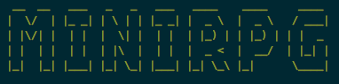

# cli-minirpg

[]()

> fast & fun minigame directly in your terminal

[](https://github.com/feross/standard)

## Install

You can get it on npm.

```
npm install cli-minirpg --global
// or
npm start
```
